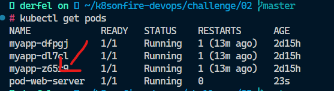
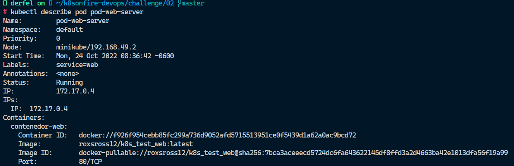
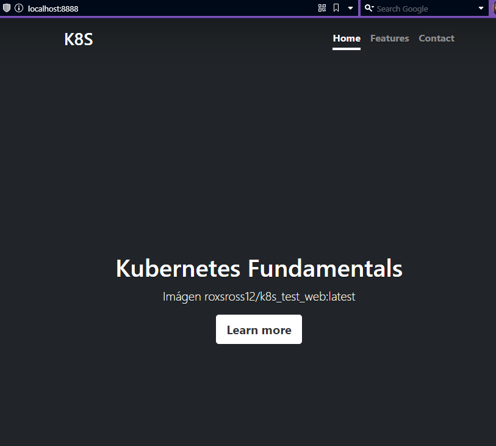
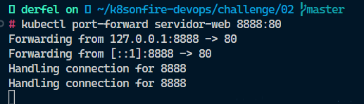

# CHALLENGE Nº 2

## Trabajando con Pods

1. Archivo yaml que has creado con la definición del Pod (**pod.yaml**).
2. Imagen donde se comprueba que el Pod ha sido creado (**imagen1.jpg**).

3. Imagen donde se ve la información detallada del Pod (**imagen2.jpg**).

4. Imagen donde se ve el fichero `index.html` del DocumentRoot (**imagen3.jpg**).

5. Imagen del navegador accediendo a la aplicación con el `port-forward` (**imagen4.jpg**).

6. Imagen donde se ve los logs de acceso del Pod (**imagen5.jpg**).

